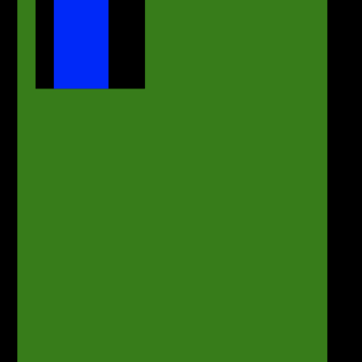
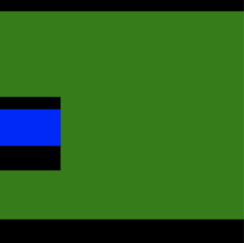
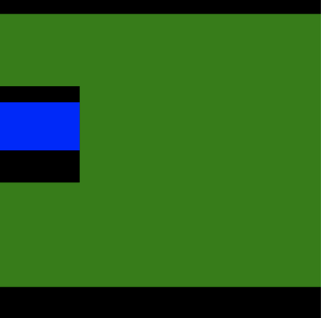
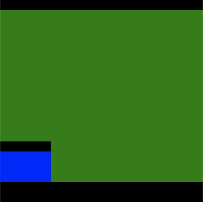
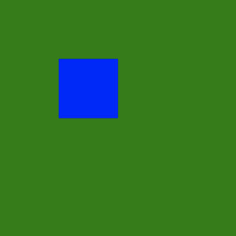
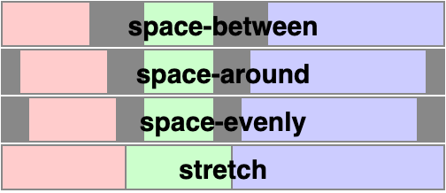
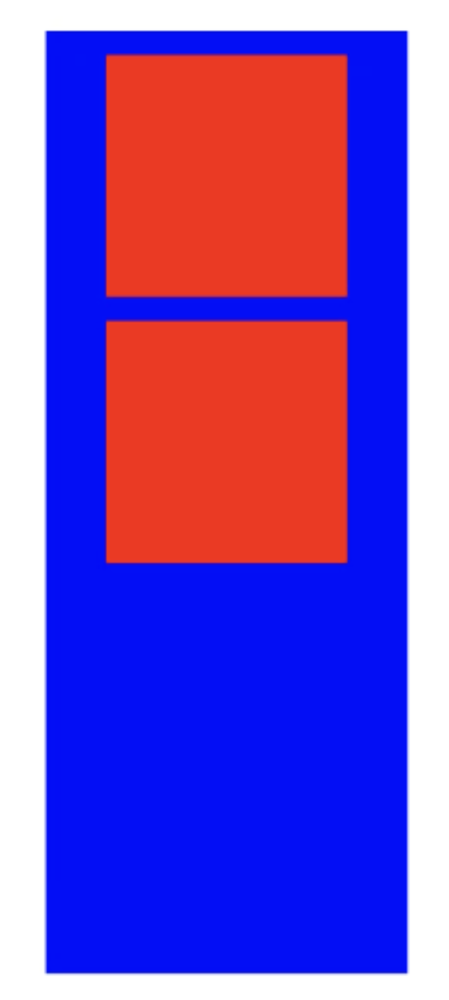

Yoga 3.0 is a new major (breaking) version of Yoga, used by React Native 0.74.

## Highlights

1. Support for `position: static`
2. Support for `align-content: space-evenly`
3. Improvements to layout correctness
4. Yoga’s JavaScript bindings are now distributed as an ES Module
5. Fixes several crashes in Java bindings
6. Some existing Yoga APIs have been removed

## position: static

We added full support for the `static` position type which has existed in an incomplete state for some time now. With this release `static` is now web-compliant in the context of Flexbox. Some things that were added/changed:

* The default position type is now `relative` [again](https://github.com/facebook/yoga/commit/fc88b2f774f0ab9090d7ca15de6680f26d7285ad) and not `static`. This should not have any effect on layout as the previously introduced `YGPositionTypeStatic` was not being used within Yoga, so it behaved just like `relative`.
* `static` nodes ignore insets (`left`, `right`, `top`, `bottom`, etc.)
* The idea of a[ containing block](../../docs/advanced/containing-block) was introduced. For `absolute` nodes this is usually the nearest non-`static` ancestor. For every other position type this is just the parent since Yoga is a Flexbox implementation.
* A new public API `YGNodeSetAlwaysFormsContainingBlock` which takes a boolean indicating if the node should always form a containing block for any descendant. This is useful for properly supporting things like [transforms](https://developer.mozilla.org/en-US/docs/Web/CSS/CSS_transforms), which will force the node to form a containing block but is outside the scope of Yoga.


`position: static` affects some concerns outside of layout, like stacking context. The full set of behaviors is enabled in the React Native New Architecture.


## Better support for absolute positioning

There were a variety of bugs with how `absolute` nodes were positioned under various `Justify` and `Align` values. Most of these bugs only ever manifested themselves with certain paddings, margins, and borders so the following examples mix those up to illustrate the differences. Additionally, the following positioning examples all share this core style:

```js
parent: {
  backgroundColor: 'green',
  height: 200,
  width: 200,
},
child: {
  position: 'absolute',
  backgroundColor: 'blue',
  height: 50,
  width: 50,
},
```

<table>

<tr>
<td>Style</td><td>Before</td><td>After</td>
</tr>

<tr>

<td>

```js
parent: {
  // core styles
  paddingLeft: 10,
  paddingRight: 20,
  borderLeftWidth: 10,
  borderRightWidth: 20,
  alignItems: 'flex-start',
},
child: {
  // core styles
  paddingLeft: 10,
  paddingRight: 20,
  marginLeft: 10,
  marginRight: 20,
  borderLeftWidth: 10,
  borderRightWidth: 20,
}
```

</td>

<td>



</td>

<td>


</td>

</tr>

<tr>

<td>

```js
parent: {
  // core styles
  paddingTop: 10,
  paddingBottom: 20,
  borderTopWidth: 10,
  borderBottomWidth: 20,
  justifyContent: 'center',
},
child: {
  // core styles
  paddingTop: 10,
  paddingBottom: 20,
  marginTop: 10,
  marginBottom: 20,
  borderTopWidth: 10,
  borderBottomWidth: 20,
}
```

</td>

<td>



</td>

<td>



</td>

</tr>

<tr>

<td>

```js
parent: {
  // core styles
  paddingTop: 10,
  paddingBottom: 20,
  borderTopWidth: 10,
  borderBottomWidth: 20,
  justifyContent: 'flex-end',
},
child: {
  // core styles
  paddingTop: 10,
  paddingBottom: 20,
  marginTop: 10,
  marginBottom: 20,
  borderTopWidth: 10,
  borderBottomWidth: 20,
}
```

</td>

<td>



</td>

<td>


</td>

</tr>

</table>


There were other fixes not specifically mentioned above. Because this change may result in layout differences for many real-world scenarios, Yoga may be configured to prefer the legacy behavior, by setting the `AbsolutePositioningIncorrect` erratum. This means this fix is not enabled by default in frameworks like React Native, in order to preserve compatibility.

Additionally, Yoga will now correctly account for padding when calculating the size of absolutely positioned nodes with percentage lengths.

<table>

<tr>
<td>Style</td><td>Before</td><td>After</td>
</tr>

<tr>

<td>

```js
parent: {
  backgroundColor: 'green',
  height: 200,
  width: 200,
  padding: 50,
},
child: {
  position: 'absolute',
  backgroundColor: 'blue',
  height: '25%',
  width: '25%',
},
```

</td>

<td>


</td>

<td>



</td>

</tr>

</table>


Just like with positioning, this fix may result in layout differences in many cases. Setting the `AbsolutePercentAgainstInnerSize` erratum will preserve the legacy behavior, which is set by default in frameworks like React Native.


## Better support for multiline containers

Yoga now offers better support for Flexbox containers which span multiple lines.

Yoga now supports `align-content: space-evenly`, contributed by [@nicoburns](https://github.com/nicoburns), to distribute line boxes with equal space around them.



> https://www.w3.org/TR/css-align-3/#distribution-values

Yoga now correctly supports the combination of `align-content` and `align-items` when both cause changes to alignment.


<table>

<tr>
<td>Style</td><td>Before</td><td>After</td>
</tr>

<tr>

<td>

```jsx

<Node
  style={{
    width: 300,
    height: 300,
    backgroundColor: 'red',
    flexDirection: 'row',
    flexWrap: 'wrap',
    alignContent: 'space-around',
    alignItems: 'flex-end',
  }}
>
  <Node
    style={{
      width: 150,
      height: 50,
      backgroundColor: 'powderblue',
    }}
  />
  <Node
    style={{
      width: 120,
      height: 100,
      backgroundColor: 'skyblue',
    }}
  />
  <Node
    style={{
      width: 120,
      height: 50,
      backgroundColor: 'steelblue',
    }}
  />
</Node>
```

</td>

<td>


</td>

<td>


</td>

</tr>

</table>

> https://github.com/facebook/yoga/issues/1008


Yoga now correctly supports `min-height` set on a multiline container.

<table>

<tr>
<td>Style</td><td>Before</td><td>After</td>
</tr>

<tr>

<td>

```jsx
<Node
  style={{
    flexDirection: 'row',
    width: 150,
    minHeight: 200,
    backgroundColor: 'blue',
    flexWrap: 'wrap',
    justifyContent: 'center',
    padding: 10,
    gap: 10,
  }}
>
  <Node
    style={{
      backgroundColor: 'red',
      height: 100,
      width: 100,
    }}
  />
  <Node
    style={{
      backgroundColor: 'red',
      height: 100,
      width: 100,
    }}
  />
</Node>
```

</td>

<td>



</td>

<td>


</td>

</tr>

</table>


## Correct handling of logical edges in row-reverse containers

Yoga would previously incorrectly reverse `start` and `end` edges, when operating on:

1. The padding, border, or margin of a row-reverse container
2. The position, of the child of a row-reverse container

In React Native, this also presents as `left` and `right` edges being swapped inside of row-reverse containers.

We determined that few enough surfaces are impacted by this bug to enable the correct behavior globally. Existing row-reverse containers which run into these cases may need to be updated to layout correctly in newer versions of Yoga.

<table>

<tr>
<td>Style</td><td>Before</td><td>After</td>
</tr>

<tr>

<td>

```jsx
<Node
  style={{
    flexDirection: 'row',
    backgroundColor: 'red',
    margin: 10,
    width: 200,
    height: 100,
  }}
>
  <Node
    style={{
      flexDirection: 'row-reverse',
      backgroundColor: 'blue',
      flex: 1,
      marginStart: 50,
    }}
  >
    <Node
      style={{
        backgroundColor: 'green',
        height: '50%',
        flex: 1,
        marginStart: 50,
      }}
    />
  </Node>
</Node>
```

</td>

<td>


</td>

<td>


</td>

</tr>

</table>

## Correct main-axis size calculation for indefinite containers using `justify-content`

Yoga previously calculated an incorrect main-axis size for containers which specified a min-dimension on the main axis, and have a `justify-content` of `space-around` or `space-between`.


<table>

<tr>
<td>Style</td><td>Before</td><td>After</td>
</tr>

<tr>

<td>

```jsx
<Node
  style={{
    flexDirection: 'row',
    backgroundColor: 'red',
    height: 75,
    minWidth: 200,
    gap: 10,
    padding: 10,
    justifyContent: 'space-between',
    alignItems: 'center',
  }}
>
  <Node
    style={{
      backgroundColor: 'blue',
      width: 50,
      height: 50,
    }}
  />
  <Node
    style={{
      backgroundColor: 'blue',
      width: 50,
      height: 50,
    }}
  />
</Node>

```

</td>

<td>


</td>

<td>


</td>

</tr>

</table>

This change was observed to impact existing layouts rarely enough to enable globally, and while this change was not present in Yoga 2.0, it was present in the version of Yoga ultimately shipped in React Native 0.73.


## Distribution as an ES Module

Yoga’s previous JavaScript package exported a convoluted matrix of different binaries, across asm.js and wasm, sync vs async, and browser vs node.

When it came time to look at adding ES Module support into the mix, we decided to take a [forward looking approach](https://github.com/WebAssembly/esm-integration/tree/main/proposals/esm-integration), and distribute Yoga as an ES Module, using top-level await, loading WebAssembly. This allows distributing a single binary which presents a sync looking API, even in browsers.

The underlying binary is still distributed as a JavaScript blob of base64 encoded WebAssembly, usable across different environments and bundlers.


## Java reliability improvements

Several crashes have been fixed in Yoga’s Java bindings:

1. Yoga for Java [no longer performs an invalid read](https://github.com/facebook/yoga/commit/38ad93c87baa2127872892a6da674fc93e84f4b8) if a message is logged
2. Yoga for Java now makes [more efficient use of JNI references](https://github.com/facebook/yoga/commit/49fbd406b62566d8b243297725d3485d9de9d442). This can help avoid app crashes in large trees, or interaction with other layout systems also using JNI.


## Infrastructure changes

Yoga’s implementation now targets a well-supported subset of C++ 20. Supported toolchains include:

1. MSVC 2019+
2. Clang/libc++ 14+
3. GCC/libstdc++ 11+
4. Android NDK 26+
5. XCode 14.3+

Yoga’s reference Android build and accompanying artifacts now target Android SDK 34.

Yoga now compiles cleanly against higher warning levels, such as `-Wextra` and `-Wconversion` in Clang/GCC, and `/W4` in MSVC.


## Deprecations and removals


### Changes to C++ APIs

Yoga’s previous structure made it easy to intermingle Yoga’s public APIs, and Yoga’s C++ implementation structures. The boundary between these two has been made firmer.

1. Every top-level header is now a public API
2. All public APIs may be used from C, C++, Objective C, and Swift


We have made some minor changes to this public API, which will require changes for Yoga integrators. The most significant is an increased const-correctness, which may require mechanical changes to measure functions. Yoga’s internal implementation has seen more radical changes.


### Removal of `UseLegacyStretchBehaviour`

APIs related to `UseLegacyStretchBehaviour` were deprecated as part of Yoga 2.0, and have now been removed. Users of `UseLegacyStretchBehaviour` should most often [set their errata level](../../docs/getting-started/configuring-yoga#layout-conformance-and-yoga-errata) to `All` to opt-out of future conformance fixes.


### Removal of YogaKit and the YogaLayout ViewGroup

Yoga previously provided direct integrations with UIKit, and the Android View System. These were deprecated as part of Yoga 2.0 and are no longer published as part of Yoga 3.0.

### Per-node `PointScaleFactor`

Yoga would previously only ever read the `PointScaleFactor` associated with the root node, even if child nodes configured a different value. Yoga now respects the `PointScaleFactor` associated with a given node. This change may be breaking for code which previously set a scale factor on a config used by the root node, where a different value was provided to child nodes.

## Integrating Yoga into your project

Yoga includes a reference CMake build, and has official bindings published across several package managers:

**JavaScript**

```json
// package.json
{
  "dependencies": {
    "yoga-layout": "^3.0.0"
   }
}
```

**Android**

```kts
// build.gradle.kts
dependencies {
  implementation("com.facebook.yoga:yoga:3.0.0")
}
```

**CocoaPods**

```rb
# Podfile
pod 'Yoga', '~> 3.0.0'
```

**SwiftPM** (new, contributed by [@cntrump](https://github.com/cntrump))

```swift
// Package.swift
import PackageDescription

let package = Package(
    dependencies: [
        .package(url: "https://github.com/facebook/yoga.git", from: "3.0.0")
    ],
)
```
