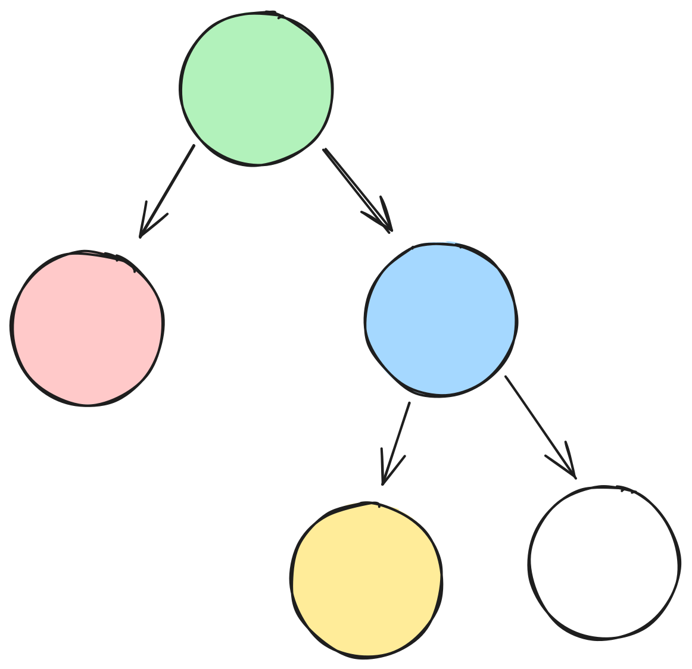

import Tabs from '@theme/Tabs';
import TabItem from '@theme/TabItem';

# Configuring Yoga

Yoga may be configured to use different behavior, using a **Yoga Config**. A config is attached to a specific Yoga Node, allowing different parts of the Yoga tree to behave differently during layout.

Most UI frameworks will apply a single uniform configuration. It is common in these cases to allocate a single Yoga Config which lasts the duration of the application. Other ownership structures are possible, which allow scenarios like laying out part of a tree with a different layout conformance than another part of the tree.

| Global | Per-node | Contextual |
| - | - | - |
|  |  |  |

<Tabs groupId="language">

<TabItem value="cpp" label="C/C++">

```cpp
#include <yoga/Yoga.h>

YGConfigRef config = YGConfigNew();
// Setup config...

YGNodeRef root = YGNodeNewWithConfig(config);
```

:::warning

Yoga configs are not freed automatically, and should be freed via `YGConfigFree(config)` when no longer needed.

:::

</TabItem>

<TabItem value="java" label="Java">

```java
import com.facebook.yoga.YogaConfigFactory;
import com.facebook.yoga.YogaNodeFactory;

YogaConfig config = YogaConfigFactory.create();
// Setup config...

YogaNode root = YogaNodeFactory.create(config);
```

</TabItem>

<TabItem value="js" label="JavaScript">

```ts
import Yoga from 'yoga-layout';

const config = Yoga.Config.create();
// Setup config...

const root = Yoga.Node.create(config);
```

:::warning

Yoga configs are not freed automatically, and should be freed via `config.free()` when no longer needed.

A future revision of JavaScript bindings for Yoga may move to garbage collection to remove this requirement.

:::

</TabItem>
</Tabs>

## Layout Conformance and Yoga Errata

Yoga has historically had several behaviors which are not standards compliant, and can lead to styles being laid out differently compared to a web browser. Fixing issues with Yoga's behavior may change the layout of existing applications written against Yoga's previous behaviors. Yoga can be configured with a set of **Errata** which control whether Yoga prefers standard compliance, or backwards compatibility. By default, Yoga will prefer standards compliance.

Errata may be configured granularity, as a set of bit flags, with several common presets available:
1. `None` (default): Prefer standards compliance. Breaking layout fixes are enabled when updating Yoga.
2. `Classic`: Operate as close as possible to Yoga 1.x.
3. `All`: Enable the errata in `Classic`, alongside `StretchFlexBasis`, mapping to `UseLegacyStretchBehaviour` in Yoga 1.x, which was not enabled by default.

<Tabs groupId="language">

<TabItem value="cpp" label="C/C++">

```cpp
#include <yoga/Yoga.h>

YGConfigRef config = YGConfigNew();
YGConfigSetErrata(config, YGErrataClassic);
```

</TabItem>

<TabItem value="java" label="Java">

```java
import com.facebook.yoga.YogaConfigFactory;
import com.facebook.yoga.YogaErrata;

YogaConfig config = YogaConfigFactory.create();
config.setErrata(YogaErrata.CLASSIC);
```

</TabItem>

<TabItem value="js" label="JavaScript">

```ts
import Yoga, {Errata} from 'yoga-layout';

const config = Yoga.Config.create();
config.setErrata(Errata.Classic);
```

</TabItem>
</Tabs>

## Point Scale Factor

Yoga represents positions on a floating-point grid of "points". This would normally lead to edges of a layout box ending up on a subpixel boundary when displayed by the underlying UI framework. This can create issues such as inconsistent rendering, or blurriness. To mitigate this, Yoga will by default round positions such that box edges are aligned to a physical "pixel grid".

Nodes may be configured with a `PointScaleFactor` to inform Yoga of the mapping between points to physical pixels (usually the "density" of the display). Pixel grid rounding may be disabled by setting `PointScaleFactor` to `0`.

| Before rounding | After rounding |
| - | - |
|  |  |

<Tabs groupId="language">

<TabItem value="cpp" label="C/C++">

```cpp
#include <yoga/Yoga.h>

YGConfigRef config = YGConfigNew();
YGConfigSetPointScaleFactor(config, 2.0f);
```

</TabItem>

<TabItem value="java" label="Java">

```java
import com.facebook.yoga.YogaConfigFactory;

YogaConfig config = YogaConfigFactory.create();
config.setPointScaleFactor(2.0f);
```

</TabItem>

<TabItem value="js" label="JavaScript">

```ts
import Yoga from 'yoga-layout';

const config = Yoga.Config.create();
config.setPointScaleFactor(2);
```

</TabItem>
</Tabs>
